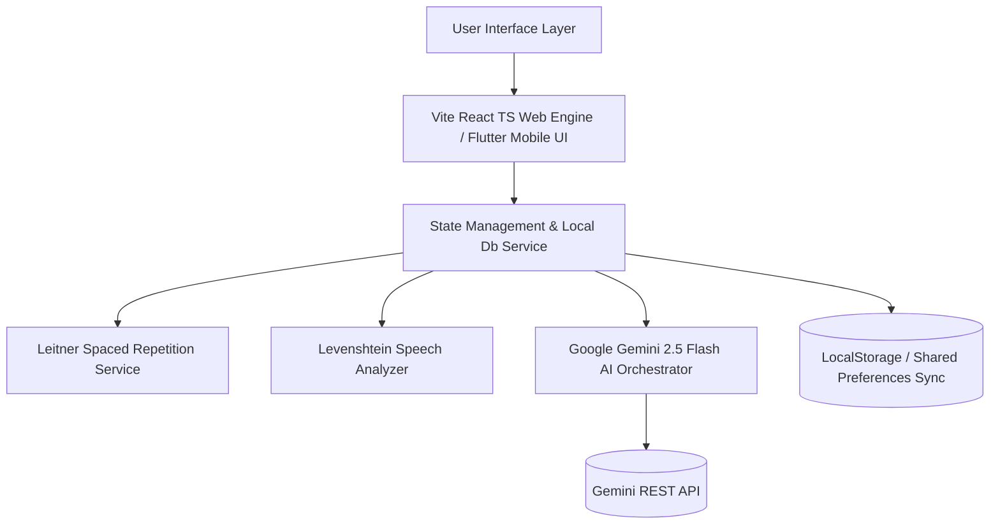

# 🌐 LinguaPop — Next-Gen AI Language Learning Platform

[](LICENSE)
[](https://vitejs.dev/)
[](https://reactjs.org/)
[](https://www.typescriptlang.org/)
[](https://ai.google.dev/)
[](https://flutter.dev/)

> **Internship Evaluation Project**  
> *A production-ready, full-featured multi-language gamified learning application featuring real-time Google Gemini AI tutoring, Leitner 5-Box Spaced Repetition, speech pronunciation diagnostic scoring, and CEFR AI reader.*

---

## 📌 Evaluator & Interviewer Quick Start

| Resource | Link / Information |
| :--- | :--- |
| **Live Web App** | [Deploy on Vercel](https://vercel.com) / [GitHub Pages](https://krushna9506.github.io/language_learning_app/) |
| **Evaluation Mode** | Pre-configured **Unlocked Demo Mode** (No registration required) |
| **Default Target Languages** | French 🇫🇷, Spanish 🇪🇸, German 🇩🇪, Italian 🇮🇹, Japanese 🇯🇵, Mandarin 🇨🇳 |
| **License** | [MIT License](LICENSE) (Open Source) |

---

## 🚀 Key Engineering & Technical Highlights

### 1. 🧠 Multi-Turn Gemini 2.5 Flash AI Language Tutor
- Powered by `gemini-2.5-flash-lite` REST integration.
- Maintains full 10-turn conversation memory with context isolation.
- Delivers **Real-time English Translation**, **Grammar Correction Tips**, and general knowledge answering in target languages.

### 2. 📈 Leitner 5-Box Spaced Repetition Algorithm
- Implements the Leitner Box Memory Model ($1 \rightarrow 2 \rightarrow 4 \rightarrow 7 \rightarrow 14$ days scaling).
- Dynamically computes priority queues based on review intervals and user performance metrics:
$$\text{Next Review Date} = \text{Last Reviewed} + \text{IntervalDays}(\text{Box})$$

### 3. 🎙️ Web Speech API & Levenshtein Pronunciation Diagnostic
- Real-time speech recognition via browser Web Speech API.
- Calculates string similarity ratio between target word and user utterance using **Levenshtein Distance**:
$$\text{Similarity}(\%) = \left(1 - \frac{\text{LevenshteinDistance}(a, b)}{\max(|a|, |b|)}\right) \times 100$$
- Gives instant color-coded feedback (85%+ Excellent, 70%+ Good, <70% Practice Needed).

### 4. 📖 CEFR Level-Tailored AI Reader & Roleplay Scenarios
- Generates CEFR A1–C1 short stories with inline key vocabulary tooltips and comprehension quizzes.
- Includes interactive real-world situational roleplays (Airport Customs, Michelin Dining, Job Interview) with live AI diagnostic scorecards.

### 5. 🎮 Duolingo-Style Gamification Engine
- **Heart System**: Deducts hearts on quiz mistakes; allows instant refills or streak-based restoration.
- **XP Progression**: Awards XP for completed reviews, AI tutor messages, and quiz mastery.
- **League Tiers**: Auto-promotes user through Bronze $\rightarrow$ Silver $\rightarrow$ Gold $\rightarrow$ Sapphire $\rightarrow$ Diamond Leagues.

---

## 🏗️ System Architecture



---

## 🛠️ Project Structure

```
language_learning_app/
├── src/                         # Vite + React + TypeScript Frontend
│   ├── components/              # UI Components
│   │   ├── Navbar.tsx           # Top navigation bar (Hearts, XP, Streak)
│   │   ├── SidebarNav.tsx       # Desktop sidebar navigation
│   │   ├── MobileDrawer.tsx     # Responsive mobile drawer navigation
│   │   ├── ErrorBoundary.tsx    # React error boundary fallback UI
│   │   └── Tabs/                # Core Feature Tabs
│   │       ├── LearnTab.tsx     # Categories & Daily Leitner Review Queue
│   │       ├── LessonTab.tsx    # Flashcards, Audio TTS & Speech Scoring
│   │       ├── AiTutorTab.tsx   # Multi-turn Gemini AI Chat Assistant
│   │       ├── AiStoriesTab.tsx # CEFR AI Short Story Reader
│   │       ├── AiScenarioTab.tsx# Real-World Roleplay Simulations
│   │       ├── QuizTab.tsx      # Timed Knowledge Quizzes
│   │       ├── QuestsTab.tsx    # Duolingo Quests & League Tiers
│   │       └── ProfileTab.tsx   # API Key Dashboard & Credentials Notice
│   ├── services/                # Business Logic Services
│   │   ├── gemini.ts            # Gemini REST API service integration
│   │   ├── aiOrchestrator.ts    # AI Story & Roleplay orchestrator
│   │   ├── leitner.ts           # Spaced repetition queue calculator
│   │   ├── levenshtein.ts       # Speech similarity scoring engine
│   │   └── localDb.ts           # Local storage persistence manager
│   ├── types/                   # TypeScript interfaces & definitions
│   └── App.tsx                  # Main Application Shell
├── lib/                         # Flutter Cross-Platform Client
│   ├── models/                  # Dart Data Models
│   ├── providers/               # Provider State Management
│   ├── screens/                 # Flutter Screen Views
│   └── services/                # Flutter Local DB & Gemini Services
├── public/                      # Static Web Assets & 404 SPA Handler
│   └── 404.html                 # GitHub Pages Single Page Application router
├── vercel.json                  # Vercel Single Page App rewrite config
├── vite.config.ts               # Vite build configuration with relative base
├── LICENSE                      # MIT Open Source License
└── README.md                    # Project Documentation
```

---

## 💻 Local Installation & Setup

### Option 1: Web Application (Vite + React + TypeScript)

1. **Clone the repository**:
   ```bash
   git clone https://github.com/krushna9506/language_learning_app.git
   cd language_learning_app
   ```

2. **Install dependencies**:
   ```bash
   npm install
   ```

3. **Configure Environment Variables (Optional)**:
   Create a `.env` file in the root directory:
   ```env
   VITE_GEMINI_API_KEY=your_gemini_api_key_here
   ```
   *(Note: The app includes fallback mock engines and allows entering custom API keys directly inside the Profile settings UI!)*

4. **Start Development Server**:
   ```bash
   npm run dev
   ```
   Open `http://localhost:3000` in your browser.

5. **Build for Production**:
   ```bash
   npm run build
   ```

---

### Option 2: Flutter Application (Mobile / Web / Desktop)

1. **Ensure Flutter SDK is installed** (version 3.12+).
2. **Fetch packages**:
   ```bash
   flutter pub get
   ```
3. **Run application**:
   ```bash
   flutter run -d chrome
   ```

---

## 📜 Credentials & Licensing Notice

- **Project Author**: Krushna ([@krushna9506](https://github.com/krushna9506))
- **Evaluation Purpose**: Developed as an Internship Evaluation Showcase Project demonstrating full-stack frontend engineering, state management, AI API integration, and algorithm design.
- **License**: Released under the **[MIT License](LICENSE)**. Free for use, modification, and educational distribution.

---

<p align="center">
  Made with ❤️ by <strong>Krushna</strong> for Internship Evaluation
</p>
